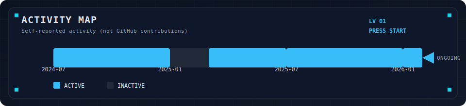

<p align="center">
  
</p>

```
┏━━━━━━━━━━━━━━━━━━━━━━━━━━━━━━━━━━━━━━┓
┃  ▶ PRESS START                       ┃
┃  PLAYER : JWookLe                    ┃
┃  CLASS  : Backend Engineer           ┃
┃  QUEST  : Build reliable systems     ┃
┗━━━━━━━━━━━━━━━━━━━━━━━━━━━━━━━━━━━━━━┛
```

# 🎮 JWookLe | Backend Engineer
**성능·신뢰성·운영 자동화를 끝까지 책임지는 풀사이클 백엔드 엔지니어**

- 대규모 트래픽 환경에서 병목을 진단하고, 부하 테스트로 개선을 검증합니다.  
- 이벤트 기반 설계로 데이터 정합성과 장애 복원력을 확보합니다.  
- 기획 → 설계 → 구현 → 운영까지 “끝까지 동작하는 서비스”를 만듭니다.  

---

## 🎯 FOCUS
- Performance Engineering  
- Reliability & Data Consistency  
- Automation & Observability  

## 🧩 ROLE TAGS
Backend · Reliability · Performance · Automation · Architecture

---

## 🗺️ QUEST LOG
**Payment_SWElite (결제 처리 마이크로서비스)**  
- 1,000+ RPS 구간 안정화, p95 Latency ~300ms 수준까지 개선  
- Transactional Outbox + Circuit Breaker 적용으로 신뢰성 확보  
- DB Sharding으로 동시성 경합 제거 및 장애 안정화  

**EmotionSync (감정 기반 추천/소셜 앱)**  
- Android ↔ Spring ↔ Flask 통합 아키텍처 설계  
- JWT 보안 저장 및 만료/갱신 전략 수립  
- WebSocket 안정화 로직으로 연결 불안정 문제 해결  

---

## 🧩 SKILL TREE
- **Backend**: Java, Spring Boot, Spring Security, Spring Data JPA, Spring Cloud  
- **Data**: MariaDB (Sharding), Redis (Cache/Rate Limit), Kafka  
- **Infra/Ops**: Docker, Jenkins, Prometheus, Grafana, K6  
- **AI Integration**: Flask, TensorFlow/Keras  

---

## 🧰 TOOLKIT
<p align="left">
  
  
  
  
  
  
</p>

---

## 🏆 ACHIEVEMENTS
- SW 아카데미 금상(2위)  
- 정보처리기사  
- SQLD  
- 프로그래머스 코딩테스트 (Python3) 935/1000, Lv.5 (2025-10-01)

---

## 🧪 FOCUS AREAS
- 성능 최적화 및 병목 제거  
- 시스템 신뢰성(Outbox, Circuit Breaker)  
- 운영 자동화(배포/모니터링/지표 기반 개선)  

---

<p align="center">
  
  
</p>

---

## 🎮 ACTIVITY MAP
<p align="center">
  
</p>

<p align="center">
  
</p>
